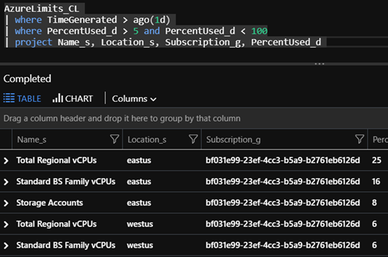
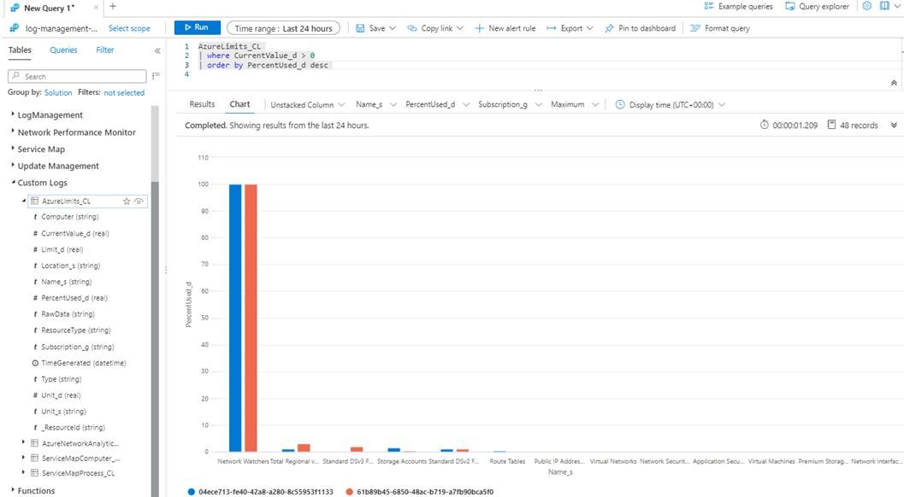

# Reports and Alerts on Azure Quotas and Limits
The Azure platform provides platform quotas to protect against runaway costs and limit resources that can be provisioned without explicitly increasing quotas to accomodate. Customers with an Enterprise Agreement enjoy automatic quota increases for Azure virtual machines, but teams may want the ability to report and alert on other platform limits such as number of Azure SQL Database logical servers or number of role assignments per subscription. These types of limits are expressed [Azure subscription and service limits, quotas, and constraints](https://docs.microsoft.com/en-us/azure/azure-resource-manager/management/azure-subscription-service-limits).

The [AzureLimits.ps1](.\AzureLimits.ps1) script provides a sample framework that enables you to query for various quotas or limits and to log current usage to Azure Log Analytics. This enables the ability to query usage over time, set alerts based on current values using the Azure Monitor Alerts feature, and to create dashboards based on query results. 

Example of querying to a table:

Example of querying to a chart:

